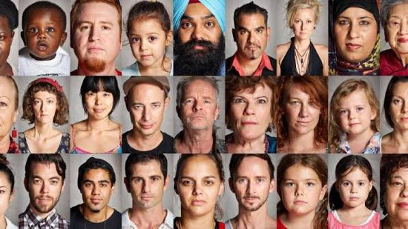

# Lab 9 - Rekognition

## Learning Objectives

1. Learn more about AI and Machine Learning services available on AWS.
2. Use boto3 to get hands-on experience on using useful AI services in AWS for Natural Language Processing (NLP)/ Natural Language Understanding (NLU) and Computer Vision.

## Technologies Covered

* AWS Comprehend
* AWS Rekognition
* boto3
* Python

## Background

The aim of this lab is to write a series of scripts that will test the main features of AWS Comprehend and AWS Rekognition.

## AWS Comprehend

**NOTE**: AWS Comprehend and Rekognition are NOT fully supported in Europe (Stockholm) (eu-north-1) and Canada (Central) (ca-central-1). If you were allocated to these 2 regions, please use Asia Pacific (Sydney) (ap-southeast-2) to complete this lab.

AWS Comprehend offers different services to analyse text using machine learning. With the Comprehend API, you will be able to perform common NLP tasks such as sentiment analysis or simply detecting the language from the text.

"Amazon Comprehend can discover the meaning and relationships in text from customer support incidents, product reviews, social media feeds, news articles, documents, and other sources. For example, you can identify the feature that's most often mentioned when customers are happy or unhappy about your product."

For example, to detect the language used in a given text using boto3, you can use the following code:

```python
import boto3
client = boto3.client('comprehend')

# Detect Entities
response = client.detect_dominant_language(
    Text="The French Revolution was a period of social and political upheaval in France and its colonies beginning in 1789 and ending in 1799.",
)

print(response['Languages'])
```

By executing the code above, we will get something like this:

```
[{'LanguageCode': 'en', 'Score': 0.9961233139038086}]
```

This means that the detected language is 'en' (English) and has a confidence in the prediction greater than 0.99.

**NOTE**: Remember that often in machine learning the confidence score is expressed as a value in the range \[0,1] where 0 indicates the lack of certainty, and 1 means totally certain of the prediction.

### Detect Languages from text

#### \[1] Modify the code above

Based on the previous code, write a Python script that can detect different languages. Besides, instead of language code (e.g., 'en' for English or 'it' for Italian), the script should return the message "\<predicted\_language> detected with confidence" where \<predicted\_language> corresponds to the name of the language in English and is given as a percentage. For the previous example, the result should look like this:

```
English was detected with 99% confidence
```

**NOTE**: The relevant APIs are available [here](https://boto3.amazonaws.com/v1/documentation/api/latest/reference/services/comprehend.html).

#### \[2] Test your code with other languages

Test your code using the following texts in different languages:

**English:** "The French Revolution was a period of social and political upheaval in France and its colonies beginning in 1789 and ending in 1799."

**Spanish:** "El Quijote es la obra más conocida de Miguel de Cervantes Saavedra. Publicada su primera parte con el título de El ingenioso hidalgo don Quijote de la Mancha a comienzos de 1605, es una de las obras más destacadas de la literatura española y la literatura universal, y una de las más traducidas. En 1615 aparecería la segunda parte del Quijote de Cervantes con el título de El ingenioso caballero don Quijote de la Mancha."

**French:** "Moi je n'étais rien Et voilà qu'aujourd'hui Je suis le gardien Du sommeil de ses nuits Je l'aime à mourir Vous pouvez détruire Tout ce qu'il vous plaira Elle n'a qu'à ouvrir L'espace de ses bras Pour tout reconstruire Pour tout reconstruire Je l'aime à mourir" \[From the Song: "Je l'Aime a Mourir" - Francis Cabrel ]

**Italian:** "L'amor che move il sole e l'altre stelle." \[Quote from "Divine Comedy" - Dante Alighieri]

### Analyse sentiment

Sentiment analysis (or opinion mining) uses NLP to determine whether data is positive, negative or neutral. Sentiment analysis is often performed on textual data to help businesses monitor brand and product sentiment in customer feedback, and understand customer needs.

Use boto3 and AWS Comprehend to create a Python script for sentiment analysis and apply the previous 4 texts to test the script.

### Detect entities

Use boto3 and AWS Comprehend to create a Python script for entity detection and apply the previous 4 texts to test the script.

### Detect keyphrases

Use boto3 and AWS Comprehend to create a Python script for keyphrase detection and apply the previous 4 texts to test the script.

### Detect syntaxes

Use boto3 and AWS Comprehend to create a Python script for syntax detection and apply the previous 4 texts to test the script.

## AWS Rekognition

AWS Rekognition is the service of AWS that allows you to perform machine learning tasks on images.

Currently, given an image, AWS Rekognition allows:

1. **Label Recognition**: automatically label objects, concepts, scenes, and actions in your images, and provide a confidence score.
2. **Image Moderation**: automatically detect explicit or suggestive adult content, or violent content in your images, and provide confidence scores.
3. **Facial Analysis**: get a complete analysis of facial attributes, including confidence scores.
4. **Extract Text from an image**: automatically detect and extract text in your images.

### Add images

Create a Python script: create an S3 bucket named as <studentid>-lab9 in the region you are mapped to. Add the following 4 images into the bucket:

1. Add the image of an urban setting (named as urban.jpg).

<figure><figcaption><p><a href="https://thewest.com.au/business/commercial-property/city-of-perth-launches-bold-city-planning-strategy-vision-that-would-transform-our-capital-ng-b881223437z">https://thewest.com.au/business/commercial-property/city-of-perth-launches-bold-city-planning-strategy-vision-that-would-transform-our-capital-ng-b881223437z</a></p></figcaption></figure>

2. Add the image of a person on the beach (named as beach.jpg).

<figure><figcaption><p><a href="https://www.expedia.com.au/lp/flights/per/suf/perth-to-lamezia-terme">https://www.expedia.com.au/lp/flights/per/suf/perth-to-lamezia-terme</a></p></figcaption></figure>

3. Add the image with people showing their faces (named as faces.jpg).

<figure><figcaption><p><a href="https://museum.wa.gov.au/explore/online-exhibitions/wa-faces">https://museum.wa.gov.au/explore/online-exhibitions/wa-faces</a></p></figcaption></figure>

4. Add the image with text (named as text.jpg).

<figure><figcaption><p><a href="https://www.studyperth.com.au/moving-to-perth/when-you-arrive/">https://www.studyperth.com.au/moving-to-perth/when-you-arrive/</a></p></figcaption></figure>

### Test AWS rekognition

Update the Python script above by using boto3 and AWS Rekognition to test label recognition, image moderation, facial analysis and text extraction from images.

**NOTE**: The relevant APIs are available [here](https://boto3.amazonaws.com/v1/documentation/api/latest/reference/services/rekognition.html).

## Important Notes

**After marking, complete the chargeable-resource cleanup described below.**

## Live Assessment Checkpoints

You do not need to submit a written report for this lab. Complete all Comprehend and Rekognition scripts before joining the marking queue. Keep the Lab 9 S3 bucket until the facilitator completes the checkpoints. The checkpoints and cleanup take no more than four minutes. Have the cleanup Console page or commands ready before joining the queue. Screenshots and saved output do not replace live results.

Before joining the queue, open the scripts and terminal, and keep the four supplied text inputs and four required images ready.

### Checkpoint 1: Language and sentiment — 1 mark

Run your program on the supplied English, Spanish, French, and Italian texts. For each text, show live Comprehend results containing:

- The language name in English, not only its language code.
- A confidence percentage.
- A sentiment label and sentiment scores.

The program must make live Comprehend calls. Hard-coded results do not meet this checkpoint.

### Checkpoint 2: Other Comprehend operations — 1 mark

For one of the supplied texts, run:

- Entity detection.
- Key-phrase detection.
- Syntax detection.

Your script must pass the detected language code to each API. Show the returned text, entity type or part of speech, and confidence value where the API provides one.

### Checkpoint 3: Rekognition — 1 mark

Open your Lab 9 bucket in the S3 Console and refresh it. Show these four objects:

- `urban.jpg`
- `beach.jpg`
- `faces.jpg`
- `text.jpg`

Then run one script that demonstrates:

- Label recognition on `urban.jpg`.
- Image moderation on `beach.jpg`.
- Facial analysis on `faces.jpg`.
- Text extraction on `text.jpg`.

Show plausible live results, including confidence values, detected faces, and extracted text. The bucket and objects must belong to you.

### Cleanup — 0.5-mark deduction if incomplete

Comprehend and Rekognition calls do not leave active compute resources. After the facilitator completes all three checkpoints, empty and delete your Lab 9 S3 bucket through the AWS Console or with commands:

```bash
aws s3 rm s3://<student-number>-lab9 --recursive
aws s3api delete-bucket --bucket <student-number>-lab9
```

Cleanup is complete when the bucket and all four objects are absent.
